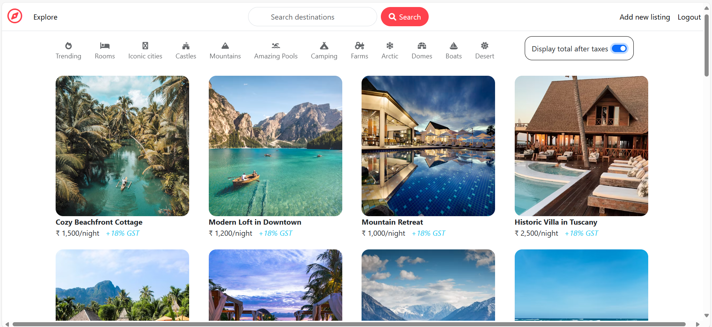
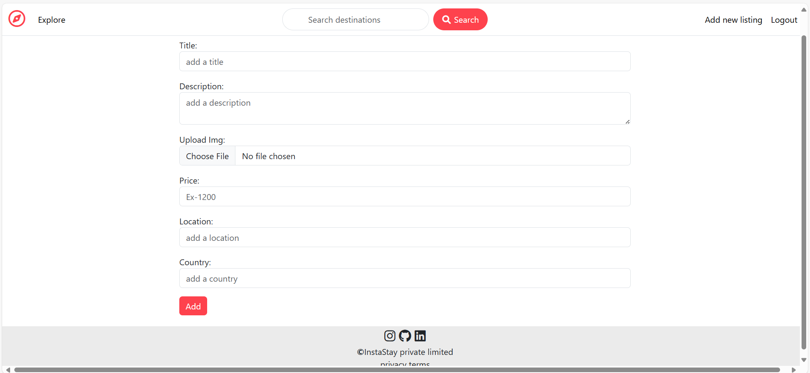
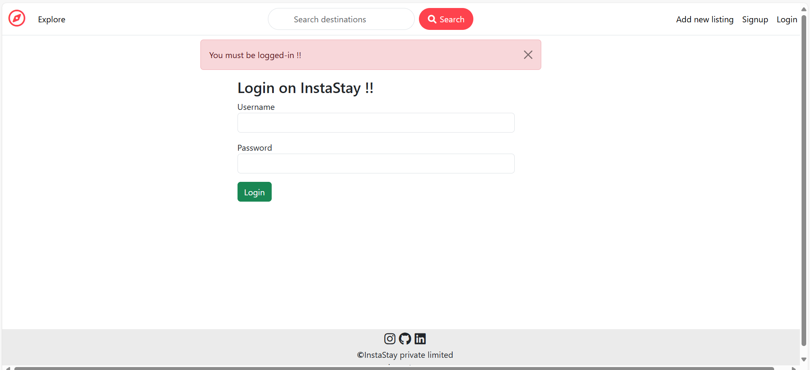
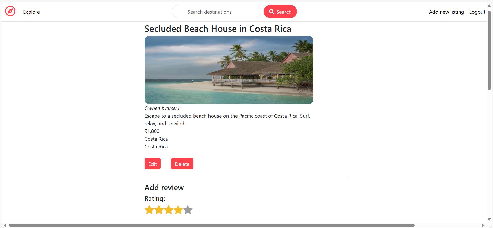
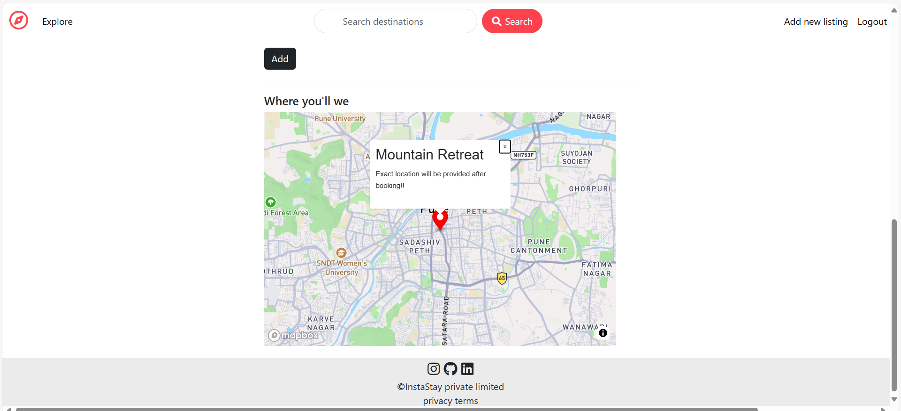

# InstaStay-MERN Stack

This project is an Airbnb clone built using the MERN stack (MongoDB, Express.js, React.js, Node.js). Below are some screenshots of the application.

## Prerequisites

Before you begin, ensure you have the following installed on your system:

- **Node.js** (v18 or later)
- **npm** (Node Package Manager)
- **MongoDB** (Local or MongoDB Atlas)

## Screenshots

### Homepage

### Add new Listing Page

### Login Page

### Show listing Page

### Show location

## Some of the Key Features:

### **MVC (Model-View-Controller) Architecture**

The application follows the **MVC design pattern** to separate the logic into three core components:

- **Model**: Represents the data and the business logic. It interacts with the database (MongoDB in this case) and contains the structure of data (like users, reviews, and properties).
  
- **View**: Represents the user interface (UI). In this application, the view is handled by the **React.js frontend**, which interacts with the backend through API calls and displays data to the user.
  - The **React.js components** handle the frontend, displaying the homepage, property listings, user login/registration forms, and reviews.
    
- **Controller**: Handles the logic that connects the Model and View. It processes user input, interacts with the models, and sends the appropriate responses to the view. 
  - **User Controller**: Handles user registration, login, and profile management.
  - **Review Controller**: Handles review submission, updating, and deletion.
  - **Session and Authentication Controller**: Manages login sessions and ensures secure access to protected routes.

By separating the logic into these three components, we ensure that the application is organized and easy to maintain, making it easier to add new features and troubleshoot issues.

### **One-to-Many Relationship (Users and Reviews)**

In our application, each user can leave multiple reviews for different properties, but each review is associated with exactly one user. This is achieved through a **one-to-many relationship** in the database. The structure is as follows:

- **User Model**: Represents a user in the system, storing user information such as name, email, password, and reviews.
- **Review Model**: Represents a review submitted by a user for a property, storing the review text, rating, and a reference to the user who created the review.

The relationship between users and reviews is established using **MongoDB's ObjectId** as a reference. Each review document contains a `userId` field, which links to the respective user in the `User` collection.

