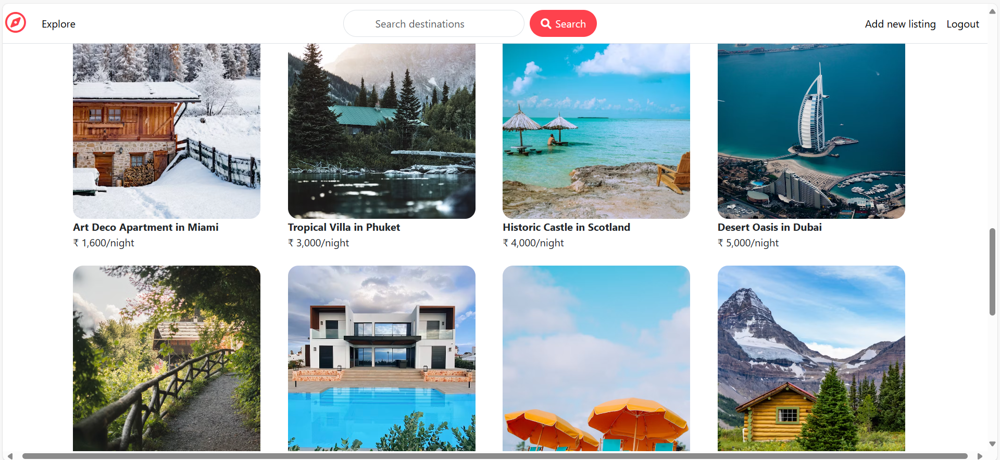

# InstaStay-MERN Stack

This project is an Airbnb clone built using the MERN stack (MongoDB, Express.js, React.js, Node.js). Below are some screenshots of the application.

## Screenshots

### Homepage

Here are two screenshots of the homepage:

### Add new Listing Page

### Login Page

## Prerequisites

Before you begin, ensure you have the following installed on your system:

- **Node.js** (v14 or later)
- **npm** (Node Package Manager)
- **MongoDB** (Local or MongoDB Atlas)
